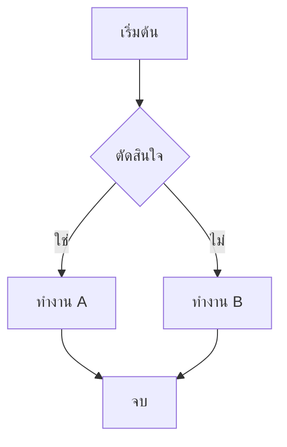
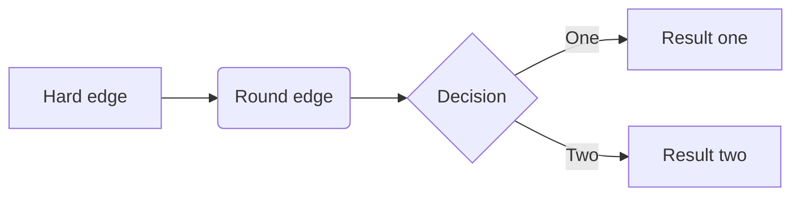

## สารบัญ
1. [Git คืออะไร](#git-คืออะไร)
2. [การติดตั้งและตั้งค่าเริ่มต้น](#การติดตั้งและตั้งค่าเริ่มต้น)
3. [คำสั่งพื้นฐาน](#คำสั่งพื้นฐาน)
4. [การจัดการ Repository](#การจัดการ-repository)
5. [การจัดการไฟล์และการเปลี่ยนแปลง](#การจัดการไฟล์และการเปลี่ยนแปลง)
6. [การจัดการ Branch](#การจัดการ-branch)
7. [การ Merge และ Rebase](#การ-merge-และ-rebase)
8. [การทำงานร่วมกับ Remote Repository](#การทำงานร่วมกับ-remote-repository)
9. [การดู History และ Log](#การดู-history-และ-log)
10. [การแก้ไขและย้อนกลับ](#การแก้ไขและย้อนกลับ)
11. [การจัดการ Tags](#การจัดการ-tags)
12. [Git Stash](#git-stash)
13. [Git Configuration](#git-configuration)
14. [คำสั่งขั้นสูง](#คำสั่งขั้นสูง)
15. [เทคนิคและ Best Practices](#เทคนิคและ-best-practices)
16. [การเขียนไฟล์README.md](#การเขียนไฟล์READMEmd)

---

## Git คืออะไร

Git เป็นระบบควบคุมเวอร์ชัน (Version Control System) แบบกระจาย (Distributed) ที่ช่วยให้นักพัฒนาสามารถติดตามการเปลี่ยนแปลงของไฟล์ และทำงานร่วมกันในโปรเจกต์ได้อย่างมีประสิทธิภาพ

### ทำไมต้องใช้ Git?

**ปัญหาแบบเดิม:** สมมติคุณกำลังทำโปรเจกต์เว็บไซต์ และมีไฟล์ดังนี้:
```
website_v1.html
website_v2.html
website_v2_backup.html
website_final.html
website_final_real.html
website_final_real_v2.html
```

**วิธี Git:** ใช้ไฟล์เดียว `website.html` แต่ Git จดจำทุกการเปลี่ยนแปลง
```bash
# ดูประวัติการเปลี่ยนแปลง
git log --oneline
a1b2c3d เพิ่มระบบ login
x4y5z6w แก้ไข CSS header
m7n8o9p เพิ่มหน้า contact
```

### ข้อดีของ Git

1. **ติดตามการเปลี่ยนแปลง**: รู้ว่าใคร เมื่อไหร่ เปลี่ยนอะไร
   ```bash
   # ตัวอย่าง: ดูว่าใครแก้ไขบรรทัดไหนในไฟล์
   git blame index.html
   ```

2. **ย้อนกลับได้**: กลับไปเวอร์ชันเก่าเมื่อเกิดข้อผิดพลาด
   ```bash
   # ย้อนกลับไปยัง commit ก่อนหน้า
   git reset --hard HEAD~1
   ```

3. **ทำงานแบบ Branch**: พัฒนาฟีเจอร์ใหม่โดยไม่กระทบโค้ดหลัก
   ```bash
   # สร้าง branch ใหม่สำหรับฟีเจอร์ login
   git checkout -b feature/login
   ```

4. **ทำงานร่วมกัน**: หลายคนแก้ไขไฟล์เดียวกันได้
   ```bash
   # คนหนึ่งทำ navbar, อีกคนทำ footer
   # Git จะรวมการเปลี่ยนแปลงให้อัตโนมัติ
   git merge feature/navbar
   ```

5. **สำรองข้อมูล**: มีสำเนาใน GitHub, GitLab
   ```bash
   # อัปโหลดไปยัง GitHub
   git push origin main
   ```

---

## การติดตั้งและตั้งค่าเริ่มต้น

### การติดตั้ง Git

**Windows:**
```bash
# ดาวน์โหลดจาก https://git-scm.com/
# หรือใช้ Chocolatey
choco install git

# หรือใช้ winget
winget install Git.Git

# ตรวจสอบการติดตั้ง
git --version
# ผลลัพธ์: git version 2.42.0.windows.1
```

**macOS:**
```bash
# ติดตั้งผ่าน Xcode Command Line Tools (แนะนำ)
xcode-select --install

# หรือใช้ Homebrew
brew install git

# หรือ MacPorts
sudo port install git

# ตรวจสอบ
git --version
# ผลลัพธ์: git version 2.42.0
```

**Linux (Ubuntu/Debian):**
```bash
# อัปเดต package list
sudo apt update

# ติดตั้ง Git
sudo apt install git

# ตรวจสอบ
git --version
# ผลลัพธ์: git version 2.34.1
```

### การตั้งค่าเริ่มต้น (จำเป็นต้องทำ!)

```bash
# ตั้งชื่อผู้ใช้ (แสดงใน commit)
git config --global user.name "สมชาย ใจดี"

# ตั้งอีเมล (ต้องตรงกับ GitHub/GitLab)
git config --global user.email "somchai@example.com"

# ตรวจสอบการตั้งค่า
git config --list | grep user
# ผลลัพธ์:
# user.name=สมชาย ใจดี
# user.email=somchai@example.com
```

### การตั้งค่า Editor

```bash
# ตั้งค่า Visual Studio Code เป็น editor
git config --global core.editor "code --wait"

# ตั้งค่า Vim
git config --global core.editor "vim"

# ตั้งค่า Nano (เหมาะสำหรับมือใหม่)
git config --global core.editor "nano"

# ทดสอบการตั้งค่า - คำสั่งนี้จะเปิด editor
git config --global --edit
```

### การตั้งค่าสำคัญอื่นๆ

```bash
# ตั้งค่าสีให้สวยงาม
git config --global color.ui auto

# ตั้งค่าชื่อ branch หลักเป็น 'main'
git config --global init.defaultBranch main

# ตั้งค่าการจัดการ line endings
# สำหรับ Windows (แปลง LF เป็น CRLF เมื่อ checkout)
git config --global core.autocrlf true

# สำหรับ macOS/Linux (แปลง CRLF เป็น LF เมื่อ commit)
git config --global core.autocrlf input

# ดูการตั้งค่าทั้งหมด
git config --list

# ดูการตั้งค่าเฉพาะ
git config user.name
# ผลลัพธ์: สมชาย ใจดี
```

### ตัวอย่างการตั้งค่าครั้งแรก

```bash
# สถานการณ์: คุณเพิ่งติดตั้ง Git ใหม่
# ขั้นตอนที่ 1: ตั้งค่าข้อมูลส่วนตัว
git config --global user.name "วิภา สายรุ้ง"
git config --global user.email "vipa.rainbow@gmail.com"

# ขั้นตอนที่ 2: ตั้งค่า editor (เลือกอันใดอันหนึ่ง)
git config --global core.editor "code --wait"  # ถ้าใช้ VS Code
# หรือ
git config --global core.editor "nano"         # ถ้าใช้ terminal

# ขั้นตอนที่ 3: ตั้งค่าสี
git config --global color.ui auto

# ขั้นตอนที่ 4: ตั้งค่า default branch
git config --global init.defaultBranch main

# ตรวจสอบการตั้งค่า
git config --global --list
```

---

## คำสั่งพื้นฐาน

### ตรวจสอบเวอร์ชันและความช่วยเหลือ

```bash
# ตรวจสอบเวอร์ชัน Git
git --version
# ผลลัพธ์: git version 2.42.0

# ดูความช่วยเหลือทั่วไป
git help
# แสดงคำสั่งพื้นฐานทั้งหมด

# ดูความช่วยเหลือสำหรับคำสั่งเฉพาะ
git help commit
git commit --help
# เปิดหน้าเว็บหรือ manual page

# ดูคำสั่งย่อๆ
git commit -h
# แสดงตัวเลือกสั้นๆ ใน terminal
```

### การสร้างและโคลน Repository

#### การสร้าง Repository ใหม่

```bash
# สถานการณ์: คุณอยากเริ่มโปรเจกต์ใหม่
mkdir my-website
cd my-website

# สร้าง repository ในโฟลเดอร์ปัจจุบัน
git init
# ผลลัพธ์: Initialized empty Git repository in /path/to/my-website/.git/

# ตรวจสอบว่าสร้างแล้ว
ls -la
# จะเห็นโฟลเดอร์ .git

# สร้าง repository ในโฟลเดอร์ใหม่
git init my-blog
# สร้างโฟลเดอร์ my-blog พร้อม git repository

# สร้าง bare repository (สำหรับเซิร์ฟเวอร์)
git init --bare server-repo.git
# ใช้เป็นจุดกลางสำหรับทีม
```

#### การโคลน Repository

```bash
# โคลน GitHub repository
git clone https://github.com/user/awesome-project.git
# สร้างโฟลเดอร์ awesome-project

# โคลนและเปลี่ยนชื่อโฟลเดอร์
git clone https://github.com/user/awesome-project.git my-project
# สร้างโฟลเดอร์ my-project

# โคลนเฉพาะ branch เดียว (ใช้เมื่อ repo ใหญ่)
git clone -b development https://github.com/user/big-project.git
# โคลนเฉพาะ branch development

# โคลนแบบ shallow (ไม่เอา history ทั้งหมด)
git clone --depth 1 https://github.com/user/huge-project.git
# เหมาะสำหรับ repo ที่มี history เยอะ

# ตัวอย่างการใช้งานจริง
git clone https://github.com/facebook/react.git
cd react
ls
# จะเห็นไฟล์ React ทั้งหมด
```

### ตัวอย่างสถานการณ์จริง

**สถานการณ์ 1: เริ่มโปรเจกต์ใหม่**
```bash
# สร้างเว็บไซต์ส่วนตัว
mkdir portfolio-website
cd portfolio-website
git init

# สร้างไฟล์แรก
echo "<!DOCTYPE html><html><head><title>My Portfolio</title></head><body><h1>สวัสดี</h1></body></html>" > index.html

# ตรวจสอบสถานะ
git status
# ผลลัพธ์:
# On branch main
# No commits yet
# Untracked files:
#   index.html
```

**สถานการณ์ 2: เข้าร่วมโปรเจกต์ที่มีอยู่**
```bash
# โคลนโปรเจกต์ของบริษัท
git clone https://github.com/company/web-app.git
cd web-app

# ดูข้อมูลโปรเจกต์
git log --oneline -5
# ดู commit 5 รายการล่าสุด

# ดู branch ทั้งหมด
git branch -a
# ดู branch ใน local และ remote
```

---

## การจัดการ Repository

### ตรวจสอบสถานะ Repository

```bash
# ดูสถานะไฟล์ทั้งหมด
git status

# ดูสถานะแบบสั้น
git status -s
git status --short

# ดูสถานะและไฟล์ที่ถูกละเว้น
git status --ignored

# ดูสถานะแบบละเอียด
git status -v
git status --verbose
```

### การตั้งค่า Remote Repository

```bash
# ดู remote ทั้งหมด
git remote
git remote -v    # ดูพร้อม URL

# เพิ่ม remote ใหม่
git remote add <name> <url>
git remote add origin https://github.com/user/repo.git

# เปลี่ยน URL ของ remote
git remote set-url <name> <new-url>

# เปลี่ยนชื่อ remote
git remote rename <old-name> <new-name>

# ลบ remote
git remote remove <name>
git remote rm <name>

# ดูข้อมูลของ remote
git remote show <name>
```

---

## การจัดการไฟล์และการเปลี่ยนแปลง

### การเพิ่มไฟล์เข้า Staging Area

```bash
# เพิ่มไฟล์เดียว
git add <filename>

# เพิ่มไฟล์หลายไฟล์
git add <file1> <file2> <file3>

# เพิ่มไฟล์ทั้งหมดในโฟลเดอร์ปัจจุบัน
git add .

# เพิ่มไฟล์ทั้งหมดใน repository
git add -A
git add --all

# เพิ่มเฉพาะไฟล์ที่ถูก tracked แล้ว
git add -u
git add --update

# เพิ่มไฟล์แบบเลือกส่วน (interactive)
git add -i
git add --interactive

# เพิ่มแค่บางส่วนของไฟล์
git add -p <filename>
git add --patch <filename>

# เพิ่มไฟล์ตามรูปแบบ
git add "*.txt"
git add src/
```

### การ Commit

```bash
# Commit พร้อมข้อความ
git commit -m "ข้อความอธิบายการเปลี่ยนแปลง"

# Commit พร้อมข้อความแบบหลายบรรทัด
git commit -m "หัวข้อ" -m "รายละเอียด"

# Commit และ add ไฟล์ที่ tracked พร้อมกัน
git commit -am "ข้อความ"

# เปิด editor เพื่อเขียนข้อความ commit
git commit

# แก้ไข commit ล่าสุด
git commit --amend

# แก้ไข commit ล่าสุดโดยเก็บข้อความเดิม
git commit --amend --no-edit

# Commit โดยไม่ต้องผ่าน pre-commit hooks
git commit --no-verify

# Commit เปล่า (ไม่มีการเปลี่ยนแปลง)
git commit --allow-empty -m "Empty commit"

# Commit พร้อมวันที่เฉพาะ
git commit --date="2023-01-01 12:00:00" -m "ข้อความ"
```

### การลบและย้ายไฟล์

```bash
# ลบไฟล์จาก working directory และ staging area
git rm <filename>

# ลบไฟล์หลายไฟล์
git rm <file1> <file2>

# ลบไฟล์แต่เก็บไว้ใน working directory
git rm --cached <filename>

# ลบโฟลเดอร์และไฟล์ข้างใน
git rm -r <folder-name>

# บังคับลบไฟล์ที่มีการแก้ไข
git rm -f <filename>

# ย้ายหรือเปลี่ยนชื่อไฟล์
git mv <old-filename> <new-filename>
```

### การดูความแตกต่าง (Diff)

```bash
# ดูความแตกต่างของไฟล์ที่ยังไม่ได้ add
git diff

# ดูความแตกต่างของไฟล์เฉพาะ
git diff <filename>

# ดูความแตกต่างของไฟล์ที่อยู่ใน staging area
git diff --staged
git diff --cached

# ดูความแตกต่างระหว่าง commit
git diff <commit1> <commit2>

# ดูความแตกต่างระหว่าง branch
git diff <branch1> <branch2>

# ดูแค่ชื่อไฟล์ที่เปลี่ยน
git diff --name-only

# ดูสถิติการเปลี่ยนแปลง
git diff --stat

# ดูความแตกต่างแบบ word-by-word
git diff --word-diff
```

---

## การจัดการ Branch

### การสร้างและเปลี่ยน Branch

```bash
# ดู branch ทั้งหมด
git branch

# ดู branch ทั้งหมดรวมถึง remote
git branch -a

# ดู remote branch
git branch -r

# สร้าง branch ใหม่
git branch <branch-name>

# สร้าง branch ใหม่จาก commit เฉพาะ
git branch <branch-name> <commit-hash>

# เปลี่ยนไป branch อื่น
git checkout <branch-name>

# สร้าง branch ใหม่และเปลี่ยนไปใช้เลย
git checkout -b <branch-name>

# สร้าง branch จาก remote branch
git checkout -b <local-branch> origin/<remote-branch>

# เปลี่ยน branch (คำสั่งใหม่)
git switch <branch-name>

# สร้าง branch ใหม่และเปลี่ยนไป (คำสั่งใหม่)
git switch -c <branch-name>
```

### การจัดการ Branch

```bash
# เปลี่ยนชื่อ branch ปัจจุบัน
git branch -m <new-branch-name>

# เปลี่ยนชื่อ branch อื่น
git branch -m <old-name> <new-name>

# ลบ branch (ต้องไม่อยู่ใน branch นั้น)
git branch -d <branch-name>

# บังคับลบ branch
git branch -D <branch-name>

# ลบ remote branch
git push origin --delete <branch-name>

# ดู branch ที่ถูก merge แล้ว
git branch --merged

# ดู branch ที่ยังไม่ได้ merge
git branch --no-merged

# ดูข้อมูลล่าสุดของแต่ละ branch
git branch -v

# ตั้งค่า upstream branch
git branch --set-upstream-to=origin/<branch-name>
git branch -u origin/<branch-name>
```

---

## การ Merge และ Rebase

### การ Merge

```bash
# Merge branch อื่นเข้ามาใน branch ปัจจุบัน
git merge <branch-name>

# Merge แบบ fast-forward (ถ้าเป็นไปได้)
git merge --ff-only <branch-name>

# Merge แบบไม่ fast-forward (สร้าง merge commit เสมอ)
git merge --no-ff <branch-name>

# Merge แต่ไม่ commit เลย
git merge --no-commit <branch-name>

# Merge พร้อมข้อความ
git merge <branch-name> -m "ข้อความ merge"

# ยกเลิก merge ที่กำลังทำอยู่
git merge --abort

# ดำเนินการ merge ต่อหลังแก้ conflict
git merge --continue
```

### การ Rebase

```bash
# Rebase branch ปัจจุบันกับ branch อื่น
git rebase <branch-name>

# Rebase แบบ interactive
git rebase -i <commit-hash>
git rebase -i HEAD~3  # rebase 3 commit ล่าสุด

# ดำเนินการ rebase ต่อหลังแก้ conflict
git rebase --continue

# ข้าม commit ปัจจุบันใน rebase
git rebase --skip

# ยกเลิก rebase
git rebase --abort

# Rebase โดยไม่สร้าง merge commit
git rebase --onto <new-base> <old-base> <branch-name>
```

### การแก้ไข Merge Conflicts

```bash
# ดูไฟล์ที่มี conflict
git status

# เปิดไฟล์แก้ conflict ด้วย merge tool
git mergetool

# หลังแก้ conflict แล้ว
git add <conflicted-file>
git commit  # สำหรับ merge
git rebase --continue  # สำหรับ rebase

# ตั้งค่า merge tool
git config --global merge.tool vimdiff
git config --global merge.tool vscode
```

---

## การทำงานร่วมกับ Remote Repository

### การ Push และ Pull

```bash
# Push ไปยัง remote repository
git push

# Push branch ใหม่ไปยัง remote
git push -u origin <branch-name>
git push --set-upstream origin <branch-name>

# Push ทุก branch
git push --all

# Push tags ทั้งหมด
git push --tags

# Push พร้อม tags
git push --follow-tags

# บังคับ push (ระวัง!)
git push --force
git push -f

# บังคับ push แบบปลอดภัย
git push --force-with-lease

# Pull จาก remote repository
git pull

# Pull จาก branch เฉพาะ
git pull origin <branch-name>

# Pull แบบ rebase
git pull --rebase

# Pull โดยไม่ commit
git pull --no-commit
```

### การ Fetch

```bash
# Fetch ข้อมูลจาก remote
git fetch

# Fetch จาก remote เฉพาะ
git fetch <remote-name>

# Fetch branch เฉพาะ
git fetch origin <branch-name>

# Fetch และลบ branch ที่ไม่มีใน remote
git fetch --prune
git fetch -p

# Fetch tags ทั้งหมด
git fetch --tags

# Fetch แบบ shallow
git fetch --depth=1
```

---

## การดู History และ Log

### การดู Commit Log

```bash
# ดู commit log พื้นฐาน
git log

# ดู log แบบสั้น
git log --oneline

# ดู log จำนวนเฉพาะ
git log -n 5
git log -5

# ดู log พร้อมกราฟ
git log --graph

# ดู log แบบสวยงาม
git log --oneline --graph --decorate --all

# ดู log ของไฟล์เฉพาะ
git log <filename>

# ดู log ตามช่วงเวลา
git log --since="2023-01-01"
git log --until="2023-12-31"
git log --since="2 weeks ago"

# ดู log ตามผู้เขียน
git log --author="ชื่อผู้เขียน"

# ดู log ตามข้อความ commit
git log --grep="bug fix"

# ดู log พร้อมการเปลี่ยนแปลง
git log -p
git log --patch

# ดูสถิติการเปลี่ยนแปลง
git log --stat

# ดู log แบบย่อ
git log --pretty=format:"%h - %an, %ar : %s"
```

### การดูประวัติการเปลี่ยนแปลง

```bash
# ดูประวัติการเปลี่ยนแปลงของไฟล์
git blame <filename>

# ดู blame พร้อมข้อมูลผู้เขียนเดิม
git blame -C <filename>

# ดู blame ตามบรรทัด
git blame -L 10,20 <filename>

# ดูการเปลี่ยนแปลงของคำสั่ง git
git reflog

# ดู reflog ของ branch เฉพาะ
git reflog <branch-name>

# ดูข้อมูลของ commit
git show <commit-hash>

# ดูไฟล์ใน commit เฉพาะ
git show <commit-hash>:<filename>
```

---

## การแก้ไขและย้อนกลับ

### การย้อนกลับการเปลี่ยนแปลง

```bash
# ย้อนกลับไฟล์ที่ยังไม่ได้ add
git checkout -- <filename>
git restore <filename>  # คำสั่งใหม่

# ย้อนกลับไฟล์ทั้งหมดที่ยังไม่ได้ add
git checkout -- .
git restore .

# ย้อนกลับไฟล์จาก staging area
git reset HEAD <filename>
git restore --staged <filename>  # คำสั่งใหม่

# ย้อนกลับไฟล์จาก commit เฉพาะ
git checkout <commit-hash> -- <filename>
git restore --source=<commit-hash> <filename>
```

### การ Reset

```bash
# Reset แบบ soft (เก็บการเปลี่ยนแปลงใน staging area)
git reset --soft <commit-hash>
git reset --soft HEAD~1  # ย้อนกลับ 1 commit

# Reset แบบ mixed (default - เก็บการเปลี่ยนแปลงใน working directory)
git reset <commit-hash>
git reset HEAD~1

# Reset แบบ hard (ลบการเปลี่ยนแปลงทั้งหมด - ระวัง!)
git reset --hard <commit-hash>
git reset --hard HEAD~1

# Reset ไฟล์เฉพาะจาก staging area
git reset <filename>
```

### การ Revert

```bash
# สร้าง commit ใหม่ที่ย้อนกลับการเปลี่ยนแปลงของ commit เฉพาะ
git revert <commit-hash>

# Revert โดยไม่สร้าง commit
git revert --no-commit <commit-hash>

# Revert หลาย commit
git revert <commit1>..<commit2>

# Revert merge commit
git revert -m 1 <merge-commit-hash>
```

### การทำความสะอาด

```bash
# ดูไฟล์ที่จะถูกลบ
git clean -n
git clean --dry-run

# ลบไฟล์ที่ไม่ได้ track
git clean -f

# ลบไฟล์และโฟลเดอร์ที่ไม่ได้ track
git clean -fd

# ลบไฟล์ที่ถูกละเว้นด้วย
git clean -fx

# ลบทั้งหมดแบบ interactive
git clean -i
```

---

## การจัดการ Tags

### การสร้าง Tags

```bash
# สร้าง lightweight tag
git tag <tag-name>

# สร้าง lightweight tag ที่ commit เฉพาะ
git tag <tag-name> <commit-hash>

# สร้าง annotated tag
git tag -a <tag-name> -m "ข้อความอธิบาย"

# สร้าง signed tag
git tag -s <tag-name> -m "ข้อความอธิบาย"

# สร้าง tag ย้อนหลัง
git tag -a v1.0 -m "เวอร์ชัน 1.0" <commit-hash>
```

### การจัดการ Tags

```bash
# ดู tags ทั้งหมด
git tag

# ดู tags ที่ตรงกับรูปแบบ
git tag -l "v1.*"

# ดูข้อมูลของ tag
git show <tag-name>

# ลบ tag ใน local
git tag -d <tag-name>

# ลบ tag ใน remote
git push origin --delete <tag-name>

# Push tag เฉพาะ
git push origin <tag-name>

# Push tags ทั้งหมด
git push origin --tags

# Checkout ไปยัง tag
git checkout <tag-name>

# สร้าง branch จาก tag
git checkout -b <branch-name> <tag-name>
```

---

## Git Stash

### การใช้ Stash

```bash
# เก็บการเปลี่ยนแปลงไว้ใน stash
git stash

# เก็บพร้อมข้อความ
git stash save "ข้อความอธิบาย"
git stash push -m "ข้อความอธิบาย"

# เก็บรวมถึงไฟล์ที่ไม่ได้ track
git stash -u
git stash --include-untracked

# เก็บทุกอย่างรวมถึงไฟล์ที่ถูกละเว้น
git stash -a
git stash --all

# เก็บเฉพาะไฟล์เฉพาะ
git stash push <filename>

# เก็บแบบ interactive
git stash -p
git stash --patch
```

### การจัดการ Stash

```bash
# ดู stash ทั้งหมด
git stash list

# ดูการเปลี่ยนแปลงใน stash
git stash show
git stash show -p  # แบบละเอียด

# นำ stash ล่าสุดมาใช้และลบออกจาก stash
git stash pop

# นำ stash เฉพาะมาใช้
git stash pop stash@{1}

# นำ stash มาใช้แต่ไม่ลบออกจาก stash
git stash apply
git stash apply stash@{1}

# ลบ stash เฉพาะ
git stash drop stash@{1}

# ลบ stash ทั้งหมด
git stash clear

# สร้าง branch จาก stash
git stash branch <branch-name>
```

---

## Git Configuration

### การตั้งค่าระดับต่างๆ

```bash
# ตั้งค่าระดับระบบ (ทุกผู้ใช้)
git config --system <key> <value>

# ตั้งค่าระดับผู้ใช้ (user ปัจจุบัน)
git config --global <key> <value>

# ตั้งค่าระดับโปรเจกต์ (repository ปัจจุบัน)
git config --local <key> <value>
git config <key> <value>  # default เป็น --local

# ดูการตั้งค่าทั้งหมด
git config --list

# ดูการตั้งค่าเฉพาะ
git config <key>

# ลบการตั้งค่า
git config --unset <key>
```

### การตั้งค่าที่สำคัญ

```bash
# ข้อมูลผู้ใช้
git config --global user.name "ชื่อผู้ใช้"
git config --global user.email "email@example.com"

# Editor
git config --global core.editor "code --wait"

# Diff tool
git config --global diff.tool vscode
git config --global difftool.vscode.cmd 'code --wait --diff $LOCAL $REMOTE'

# Merge tool
git config --global merge.tool vscode
git config --global mergetool.vscode.cmd 'code --wait $MERGED'

# การจัดการ line endings
git config --global core.autocrlf true     # Windows
git config --global core.autocrlf input    # Mac/Linux

# การตั้งค่า push default
git config --global push.default simple

# การตั้งค่า pull default
git config --global pull.rebase false

# Aliases
git config --global alias.st status
git config --global alias.co checkout
git config --global alias.br branch
git config --global alias.ci commit
git config --global alias.unstage 'reset HEAD --'
git config --global alias.last 'log -1 HEAD'
git config --global alias.visual '!gitk'
```

---

## คำสั่งขั้นสูง

### Git Cherry-pick

```bash
# นำ commit เฉพาะมาใช้
git cherry-pick <commit-hash>

# นำหลาย commit มาใช้
git cherry-pick <commit1> <commit2>

# นำช่วง commit มาใช้
git cherry-pick <start-commit>..<end-commit>

# Cherry-pick โดยไม่ commit
git cherry-pick --no-commit <commit-hash>

# แก้ไขข้อความ commit ขณะ cherry-pick
git cherry-pick --edit <commit-hash>

# ดำเนินการต่อหลังแก้ conflict
git cherry-pick --continue

# ยกเลิก cherry-pick
git cherry-pick --abort
```

### Git Bisect

```bash
# เริ่ม bisect
git bisect start

# กำหนด commit ที่มีปัญหา
git bisect bad <commit-hash>

# กำหนด commit ที่ไม่มีปัญหา
git bisect good <commit-hash>

# ทดสอบ commit ปัจจุบันและกำหนดสถานะ
git bisect good    # ถ้าไม่มีปัญหา
git bisect bad     # ถ้ามีปัญหา

# ข้าม commit ปัจจุบัน
git bisect skip

# เสร็จสิ้น bisect
git bisect reset

# Bisect แบบอัตโนมัติ
git bisect run <command>
```

### Git Submodules

```bash
# เพิ่ม submodule
git submodule add <repository-url> <path>

# โคลน repository พร้อม submodules
git clone --recursive <repository-url>

# เริ่มต้น submodules ใน repository ที่มีอยู่
git submodule init

# อัปเดต submodules
git submodule update

# เริ่มต้นและอัปเดต submodules พร้อมกัน
git submodule update --init

# อัปเดต submodules แบบ recursive
git submodule update --init --recursive

# อัปเดต submodules ไปยังเวอร์ชันล่าสุด
git submodule update --remote

# ดู status ของ submodules
git submodule status

# ลบ submodule
git submodule deinit <path>
git rm <path>
rm -rf .git/modules/<path>
```

### Git Worktree

```bash
# สร้าง worktree ใหม่
git worktree add <path> <branch-name>

# สร้าง worktree พร้อม branch ใหม่
git worktree add -b <new-branch> <path>

# ดู worktrees ทั้งหมด
git worktree list

# ลบ worktree
git worktree remove <path>

# ทำความสะอาด worktree ที่ไม่มีอยู่แล้ว
git worktree prune
```

### Git Archive

```bash
# สร้างไฟล์ archive จาก HEAD
git archive HEAD --format=zip > project.zip

# สร้าง archive จาก branch เฉพาะ
git archive <branch-name> --format=tar.gz > project.tar.gz

# สร้าง archive จาก tag
git archive v1.0 --format=zip --prefix=project-v1.0/ > release.zip

# สร้าง archive เฉพาะโฟลเดอร์
git archive HEAD:src/ --format=zip > src.zip
```

### Git Filter-branch และ Git Filter-repo

```bash
# ลบไฟล์ออกจากประวัติทั้งหมด (ใช้ filter-branch - deprecated)
git filter-branch --force --index-filter \
  'git rm --cached --ignore-unmatch <filename>' \
  --prune-empty --tag-name-filter cat -- --all

# ใช้ git-filter-repo (แนะนำ)
# ติดตั้งก่อน: pip install git-filter-repo

# ลบไฟล์ออกจากประวัติ
git filter-repo --path <filename> --invert-paths

# ลบโฟลเดอร์ออกจากประวัติ
git filter-repo --path <folder-name> --invert-paths

# เปลี่ยนชื่อผู้เขียน
git filter-repo --commit-callback '
  if commit.author_name == b"Old Name":
    commit.author_name = b"New Name"
    commit.author_email = b"new@email.com"
'
```

---

## เทคนิคและ Best Practices

### Git Aliases ที่มีประโยชน์

```bash
# ตั้งค่า aliases ที่มีประโยชน์
git config --global alias.s status
git config --global alias.a add
git config --global alias.c commit
git config --global alias.cm 'commit -m'
git config --global alias.co checkout
git config --global alias.br branch
git config --global alias.df diff
git config --global alias.dfs 'diff --staged'

# Log aliases
git config --global alias.lg "log --oneline --graph --decorate --all"
git config --global alias.ll "log --pretty=format:'%C(yellow)%h%Creset %C(blue)%ad%Creset %C(green)%an%Creset %s' --date=short"
git config --global alias.last 'log -1 HEAD'

# อื่นๆ
git config --global alias.unstage 'reset HEAD --'
git config --global alias.uncommit 'reset --soft HEAD~1'
git config --global alias.amend 'commit --amend --no-edit'
git config --global alias.pushf 'push --force-with-lease'
```

### การจัดการ .gitignore

```bash
# สร้างไฟล์ .gitignore
touch .gitignore

# ตัวอย่างเนื้อหาในไฟล์ .gitignore
echo "
# Dependencies
node_modules/
vendor/

# Build outputs
dist/
build/
*.exe
*.dll

# Logs
*.log
logs/

# Environment variables
.env
.env.local

# IDE files
.vscode/
.idea/
*.swp
*.swo

# OS files
.DS_Store
Thumbs.db

# Temporary files
*.tmp
*.temp
" > .gitignore

# ลบไฟล์ที่ถูก track แล้วออกจาก Git
git rm --cached <filename>

# อัปเดต .gitignore สำหรับไฟล์ที่ถูก track แล้ว
git rm -r --cached .
git add .
git commit -m "Update .gitignore"
```

### การเขียน Commit Messages ที่ดี

```bash
# รูปแบบ Conventional Commits
# <type>(<scope>): <description>
#
# <body>
#
# <footer>

# ตัวอย่าง:
git commit -m "feat(auth): add login with Google OAuth

- Implement Google OAuth 2.0 integration
- Add login button to homepage
- Handle authentication errors

Closes #123"

# Types ที่นิยมใช้:
# feat: คุณสมบัติใหม่
# fix: แก้ไขบั๊ก
# docs: อัปเดตเอกสาร
# style: แก้ไขรูปแบบโค้ด
# refactor: ปรับปรุงโค้ดโดยไม่เปลี่ยนการทำงาน
# test: เพิ่มหรือแก้ไขการทดสอบ
# chore: งานจัดการโปรเจกต์
```

### Git Hooks

```bash
# ดู hooks ที่มีอยู่
ls .git/hooks/

# สร้าง pre-commit hook
cat > .git/hooks/pre-commit << 'EOF'
#!/bin/bash
# ตรวจสอบรูปแบบโค้ดก่อน commit
npm run lint
EOF

chmod +x .git/hooks/pre-commit

# สร้าง commit-msg hook
cat > .git/hooks/commit-msg << 'EOF'
#!/bin/bash
# ตรวจสอบรูปแบบข้อความ commit
commit_regex='^(feat|fix|docs|style|refactor|test|chore)(\(.+\))?: .{1,50}'

if ! grep -qE "$commit_regex" "$1"; then
    echo "Invalid commit message format!"
    echo "Format: type(scope): description"
    exit 1
fi
EOF

chmod +x .git/hooks/commit-msg
```

### การแก้ไขปัญหาทั่วไป

```bash
# แก้ไข "fatal: refusing to merge unrelated histories"
git pull --allow-unrelated-histories

# ลบ branch ที่ถูกลบใน remote แล้ว
git remote prune origin

# แก้ไข line ending issues
git config core.autocrlf true  # Windows
git config core.autocrlf input # Mac/Linux

# ลบ credentials ที่เก่า
git config --global --unset credential.helper

# แก้ไข "SSL certificate problem"
git config --global http.sslverify false  # ไม่แนะนำสำหรับ production

# ตั้งค่า proxy
git config --global http.proxy http://proxy.company.com:8080
git config --global https.proxy https://proxy.company.com:8080

# ลบการตั้งค่า proxy
git config --global --unset http.proxy
git config --global --unset https.proxy
```

### การเพิ่มประสิทธิภาพ

```bash
# ทำความสะอาด repository
git gc

# ทำความสะอาดแบบ aggressive
git gc --aggressive

# ตรวจสอบขนาด repository
git count-objects -vH

# ลด shallow clone ให้เป็น full clone
git fetch --unshallow

# Clone แบบ partial (Git 2.19+)
git clone --filter=blob:none <url>

# ตั้งค่า maintenance
git maintenance start
git maintenance run

# การตั้งค่าสำหรับ repository ใหญ่
git config core.preloadindex true
git config core.fscache true
git config gc.auto 256
```

### Git Flow Workflow

```bash
# เริ่มต้นโปรเจกต์ใหม่
git flow init

# เริ่ม feature ใหม่
git flow feature start <feature-name>

# เสร็จสิ้น feature
git flow feature finish <feature-name>

# เริ่ม release ใหม่
git flow release start <version>

# เสร็จสิ้น release
git flow release finish <version>

# เริ่ม hotfix
git flow hotfix start <version>

# เสร็จสิ้น hotfix
git flow hotfix finish <version>
```

### การ Backup และ Recovery

```bash
# สร้าง backup
git bundle create backup.bundle --all

# Restore จาก backup
git clone backup.bundle restored-repo

# สร้าง mirror repository
git clone --mirror <original-repo-url>

# Recovery commit ที่หายไป
git reflog
git cherry-pick <lost-commit-hash>

# กู้คืนไฟล์ที่ถูกลบ
git ls-files --deleted
git checkout HEAD -- <deleted-file>
```

### การวิเคราะห์ Repository

```bash
# วิเคราะห์ contributor
git shortlog -sn

# ดูไฟล์ที่เปลี่ยนแปลงบ่อยที่สุด
git log --name-only --pretty=format: | grep -v "^$" | sort | uniqc -c | sort -rn

# ดูขนาดของไฟล์ใน repository
git ls-tree -r -t -l --full-name HEAD | sort -n -k 4

# วิเคราะห์การเปลี่ยนแปลงต่อวัน
git log --format="%ad" --date=short | sort | uniq -c

# ดูจำนวนบรรทัดที่เพิ่ม/ลบ
git log --shortstat --pretty=format: | grep -E "fil(e|es) changed" | awk '{files+=$1; inserted+=$4; deleted+=$6} END {print "Files changed:", files, "Lines inserted:", inserted, "Lines deleted:", deleted}'
```

---

## สรุป

Git เป็นเครื่องมือที่ทรงพลังสำหรับการจัดการเวอร์ชันของโค้ด คู่มือนี้ครอบคลุมคำสั่งและเทคนิคต่างๆ ตั้งแต่พื้นฐานจนถึงขั้นสูง การฝึกฝนใช้คำสั่งเหล่านี้อย่างสม่ำเสมอจะช่วยให้คุณเชี่ยวชาญ Git และสามารถจัดการโปรเจกต์ได้อย่างมีประสิทธิภาพ

### เคล็ดลับสำหรับมือใหม่

1. **เริ่มจากคำสั่งพื้นฐาน**: `git add`, `git commit`, `git push`, `git pull`
2. **ใช้ `git status` บ่อยๆ**: เพื่อตรวจสอบสถานะของไฟล์
3. **เขียน commit message ที่ดี**: อธิบายการเปลี่ยนแปลงอย่างชัดเจน
4. **สร้าง branch สำหรับ feature ใหม่**: อย่าทำงานใน main branch โดยตรง
5. **ใช้ `.gitignore`**: เพื่อไม่ให้ไฟล์ที่ไม่ต้องการถูก track

### แหล่งข้อมูลเพิ่มเติม

- [Git Official Documentation](https://git-scm.com/doc)
- [Pro Git Book](https://git-scm.com/book)
- [Git Cheat Sheet](https://education.github.com/git-cheat-sheet-education.pdf)
- [Interactive Git Tutorial](https://learngitbranching.js.org/)

จำไว้ว่า Git มีความซับซ้อน แต่ด้วยการฝึกฝนและใช้งานอย่างสม่ำเสมอ คุณจะเชี่ยวชาญและใช้ประโยชน์จาก Git ได้อย่างเต็มที่!

## การเขียนไฟล์README.md

## คู่มือการเขียนไฟล์ Markdown (.md) อย่างครอบคลุม

## 1. บทนำ

### 1.1 Markdown คืออะไร
Markdown เป็นภาษามาร์กอัปที่เรียบง่าย ออกแบบมาเพื่อให้การเขียนเอกสารทำได้ง่ายและอ่านง่าย สามารถแปลงเป็น HTML ได้อย่างรวดเร็ว

### 1.2 ประโยชน์ของ Markdown
- เขียนง่าย อ่านง่าย
- รองรับในแพลตฟอร์มหลากหลาย (GitHub, GitLab, Reddit, Discord)
- แปลงเป็น HTML, PDF ได้
- ไม่ต้องพึ่งพาซอฟต์แวร์พิเศษ
- ขนาดไฟล์เล็ก

### 1.3 การใช้งานทั่วไป
- เอกสารโปรเจ็กต์ (README.md)
- บทความบล็อก
- เอกสารทางเทคนิค
- บันทึกส่วนตัว
- การนำเสนอแบบง่าย

## 2. ไวยากรณ์พื้นฐาน

### 2.1 หัวข้อ (Headers)

```markdown
# หัวข้อใหญ่ (H1)
## หัวข้อรอง (H2)
### หัวข้อย่อย (H3)
#### หัวข้อย่อยย่อย (H4)
##### หัวข้อระดับ 5 (H5)
###### หัวข้อระดับ 6 (H6)
```

**วิธีเขียนทางเลือก:**
```markdown
หัวข้อใหญ่
=========

หัวข้อรอง
---------
```

### 2.2 การจัดรูปแบบข้อความ

#### 2.2.1 ตัวหนา (Bold)
```markdown
**ข้อความตัวหนา**
__ข้อความตัวหนา__
```

#### 2.2.2 ตัวเอียง (Italic)
```markdown
*ข้อความตัวเอียง*
_ข้อความตัวเอียง_
```

#### 2.2.3 ตัวหนาและเอียง
```markdown
***ข้อความตัวหนาและเอียง***
___ข้อความตัวหนาและเอียง___
**_ข้อความตัวหนาและเอียง_**
```

#### 2.2.4 ข้อความขีดฆ่า (Strikethrough)
```markdown
~~ข้อความที่ถูกขีดฆ่า~~
```

#### 2.2.5 ข้อความเน้น (Highlight)
```markdown
==ข้อความที่เน้น==
```

### 2.3 การขึ้นบรรทัดใหม่

#### 2.3.1 บรรทัดใหม่
- เพิ่ม 2 ช่องว่างท้ายบรรทัด + Enter
- หรือเว้น 1 บรรทัดว่าง

#### 2.3.2 ขึ้นย่อหน้าใหม่
- เว้น 1 บรรทัดว่างระหว่างย่อหน้า

## 3. รายการ (Lists)

### 3.1 รายการไม่มีลำดับ (Unordered Lists)
```markdown
- รายการที่ 1
- รายการที่ 2
  - รายการย่อย 2.1
  - รายการย่อย 2.2
- รายการที่ 3

* รายการที่ 1
* รายการที่ 2

+ รายการที่ 1
+ รายการที่ 2
```

### 3.2 รายการมีลำดับ (Ordered Lists)
```markdown
1. รายการที่ 1
2. รายการที่ 2
   1. รายการย่อย 2.1
   2. รายการย่อย 2.2
3. รายการที่ 3
```

### 3.3 รายการกิจกรรม (Task Lists)
```markdown
- [x] งานที่เสร็จแล้ว
- [ ] งานที่ยังไม่เสร็จ
- [x] งานที่เสร็จแล้ว
  - [ ] งานย่อยที่ยังไม่เสร็จ
  - [x] งานย่อยที่เสร็จแล้ว
```

## 4. ลิงก์และรูปภาพ

### 4.1 ลิงก์ (Links)

#### 4.1.1 ลิงก์ธรรมดา
```markdown
[ข้อความที่แสดง](https://example.com)
[ข้อความที่แสดง](https://example.com "คำอธิบายเพิ่มเติม")
```

#### 4.1.2 ลิงก์อ้างอิง (Reference Links)
```markdown
[ข้อความที่แสดง][1]
[ข้อความที่แสดง][reference-name]

[1]: https://example.com
[reference-name]: https://example.com "คำอธิบาย"
```

#### 4.1.3 ลิงก์อัตโนมัติ
```markdown
<https://example.com>
<email@example.com>
```

### 4.2 รูปภาพ (Images)

#### 4.2.1 รูปภาพธรรมดา
```markdown


```

#### 4.2.2 รูปภาพอ้างอิง
```markdown
![Alt text][image-ref]

[image-ref]: image.jpg "คำอธิบาย"
```

#### 4.2.3 รูปภาพที่คลิกได้
```markdown
[](https://example.com)
```

## 5. โค้ด (Code)

### 5.1 โค้ดในบรรทัด (Inline Code)
```markdown
ใช้ `console.log()` เพื่อแสดงผล
```

### 5.2 บลอกโค้ด (Code Blocks)

#### 5.2.1 แบบเว้นช่องว่าง 4 ช่อง
```
    function hello() {
        console.log("Hello World!");
    }
```

#### 5.2.2 แบบใช้ Backticks
```markdown
```
function hello() {
    console.log("Hello World!");
}
```
```

#### 5.2.3 บลอกโค้ดพร้อมภาษา
```markdown
```javascript
function hello() {
    console.log("Hello World!");
}
```

```python
def hello():
    print("Hello World!")
```

```css
.container {
    max-width: 1200px;
    margin: 0 auto;
}
```
```

## 6. ตาราง (Tables)

### 6.1 ตารางพื้นฐาน
```markdown
| หัวข้อ 1 | หัวข้อ 2 | หัวข้อ 3 |
|----------|----------|----------|
| ข้อมูล 1 | ข้อมูล 2 | ข้อมูล 3 |
| ข้อมูล 4 | ข้อมูล 5 | ข้อมูล 6 |
```

### 6.2 การจัดตำแหน่งในตาราง
```markdown
| ซ้าย     | กลาง      | ขวา      |
|:---------|:---------:|---------:|
| ซ้าย     | กลาง      | ขวา      |
| L        | C         | R        |
```

### 6.3 ตารางที่ซับซ้อน
```markdown
| ฟีเจอร์           | ฟรี | โปร | เอ็นเตอร์ไพรส์ |
|:-----------------|:---:|:---:|:-------------:|
| จำนวนผู้ใช้      | 5   | 50  | ไม่จำกัด      |
| พื้นที่เก็บข้อมูล | 1GB | 10GB| 100GB        |
| การสนับสนุน       | ❌  | ⭕  | ⭕            |
```

## 7. การอ้างอิงและเชิงอรรถ

### 7.1 การอ้างอิง (Blockquotes)
```markdown
> นี่คือการอ้างอิงแบบบรรทัดเดียว

> นี่คือการอ้างอิงแบบหลายบรรทัด
> บรรทัดที่สอง
> บรรทัดที่สาม

> ## หัวข้อในการอ้างอิง
> 
> - รายการในการอ้างอิง
> - รายการที่สอง
> 
> **ข้อความตัวหนา** ในการอ้างอิง
```

### 7.2 การอ้างอิงซ้อน
```markdown
> การอ้างอิงระดับที่ 1
> 
> > การอ้างอิงระดับที่ 2
> > 
> > > การอ้างอิงระดับที่ 3
```

### 7.3 เชิงอรรถ (Footnotes)
```markdown
นี่คือข้อความที่มีเชิงอรรถ[^1]

ข้อความอื่น[^note]

[^1]: นี่คือเชิงอรรถที่ 1
[^note]: นี่คือเชิงอรรถที่มีชื่อ
```

## 8. เส้นแบ่ง (Horizontal Rules)

```markdown
---

***

___

- - -

* * *
```

## 9. การใส่อิโมจิ (Emoji)

### 9.1 Unicode Emoji
```markdown
😀 😃 😄 😁 😆 😅 😂 🤣
❤️ 💕 💖 💗 💘 💙 💚 💛
👍 👎 👌 🤝 🙏 💪 🎉 🎊
```

### 9.2 Emoji Shortcodes
```markdown
:smile: :heart: :thumbsup: :fire: :rocket:
:warning: :information_source: :question:
:white_check_mark: :x: :heavy_check_mark:
```

## 10. HTML ใน Markdown

### 10.1 HTML Tags ที่ใช้ได้
```markdown
<strong>ข้อความตัวหนา</strong>
<em>ข้อความตัวเอียง</em>
<u>ข้อความขีดเส้นใต้</u>
<s>ข้อความขีดฆ่า</s>

<br> <!-- บรรทัดใหม่ -->
<hr> <!-- เส้นแบ่ง -->

<mark>ข้อความไฮไลต์</mark>
<sub>ตัวห้อย</sub>
<sup>ตัวยก</sup>
```

### 10.2 Div และ Span
```markdown
<div align="center">
  ข้อความอยู่ตรงกลาง
</div>

<span style="color: red;">ข้อความสีแดง</span>
```

## 11. คณิตศาสตร์ (Math)

### 11.1 สูตรคณิตศาสตร์ในบรรทัด
```markdown
สูตรพีทาโกรัส: $a^2 + b^2 = c^2$
```

### 11.2 สูตรคณิตศาสตร์แยกบรรทัด
```markdown
$$
\int_{-\infty}^{\infty} e^{-x^2} dx = \sqrt{\pi}
$$

$$
E = mc^2
$$
```

## 12. ไดอะแกรม (Diagrams)

### 12.1 Mermaid Diagrams
```markdown

```

### 12.2 Flowchart
```markdown

```

## 13. การจัดระเบียบเนื้อหา

### 13.1 สารบัญ (Table of Contents)
```markdown
## สารบัญ

1. [บทนำ](#บทนำ)
2. [การติดตั้ง](#การติดตั้ง)
3. [การใช้งาน](#การใช้งาน)
   - [ฟีเจอร์ A](#ฟีเจอร์-a)
   - [ฟีเจอร์ B](#ฟีเจอร์-b)
4. [สรุป](#สรุป)
```

### 13.2 กล่องข้อมูล (Admonitions)
```markdown
> **หมายเหตุ:** นี่คือข้อมูลสำคัญ

> ⚠️ **คำเตือน:** ระวังการใช้งาน

> ✅ **เคล็ดลับ:** วิธีที่ดีที่สุด

> ❌ **ข้อผิดพลาด:** สิ่งที่ต้องหลีกเลี่ยง
```

### 13.3 รายละเอียดที่พับได้ (Collapsible Details)
```markdown
<details>
<summary>คลิกเพื่อดูรายละเอียด</summary>

นี่คือเนื้อหาที่ซ่อนอยู่
- รายการที่ 1
- รายการที่ 2
- รายการที่ 3

```javascript
console.log("โค้ดตัวอย่าง");
```

</details>
```

## 14. การใช้งานขั้นสูง

### 14.1 การเพิ่มคลาส CSS
```markdown
{: .class-name}
ข้อความที่มีคลาส

{: .red}
ข้อความสีแดง
```

### 14.2 การเพิ่ม ID
```markdown
## หัวข้อ {#custom-id}

[ลิงก์ไปหัวข้อ](#custom-id)
```

### 14.3 การแทรกไฟล์
```markdown



```

## 15. เครื่องมือและแอปพลิเคชัน

### 15.1 เครื่องมือแก้ไข
- **Online:** GitHub, GitLab, Notion, HackMD
- **Desktop:** Typora, Mark Text, Obsidian
- **Code Editors:** VS Code, Atom, Sublime Text

### 15.2 การแปลงไฟล์
- **เป็น HTML:** Pandoc, Marked
- **เป็น PDF:** Pandoc, wkhtmltopdf
- **เป็น Word:** Pandoc

### 15.3 การตรวจสอบ
- **Linting:** markdownlint
- **Preview:** GitHub Pages, Netlify

## 16. เทคนิคการเขียนที่ดี

### 16.1 โครงสร้างเอกสาร
```markdown
# ชื่อโปรเจ็กต์

## คำอธิบายย่อ

## การติดตั้ง

## การใช้งาน

## API Reference

## การพัฒนา

## License
```

### 16.2 การตั้งชื่อไฟล์
- ใช้ตัวอักษรเล็ก
- ใช้เครื่องหมาย `-` หรือ `_`
- อธิบายเนื้อหาได้ชัดเจน

```
README.md
installation-guide.md
api-reference.md
```

### 16.3 การจัดรูปแบบที่สม่ำเสมอ
- ใช้หัวข้อตามลำดับ (H1 → H2 → H3)
- เว้นบรรทัดระหว่างส่วนต่างๆ
- ใช้การจัดรูปแบบเหมือนกันทั้งเอกสาร

## 17. ข้อผิดพลาดที่พบบ่อย

### 17.1 การใช้หัวข้อ
❌ **ผิด:**
```markdown
# หัวข้อใหญ่
### หัวข้อย่อย (ข้าม H2)
```

✅ **ถูก:**
```markdown
# หัวข้อใหญ่
## หัวข้อรอง
### หัวข้อย่อย
```

### 17.2 การใช้ลิงก์
❌ **ผิด:**
```markdown
[ลิงก์](www.example.com)
```

✅ **ถูก:**
```markdown
[ลิงก์](https://www.example.com)
```

### 17.3 การใช้รายการ
❌ **ผิด:**
```markdown
-รายการที่ 1
- รายการที่ 2
```

✅ **ถูก:**
```markdown
- รายการที่ 1
- รายการที่ 2
```

## 18. ตัวอย่างไฟล์ README.md

```markdown
# ชื่อโปรเจ็กต์

[](LICENSE)
[](CHANGELOG.md)

คำอธิบายโปรเจ็กต์สั้นๆ และวัตถุประสงค์หลัก

## ฟีเจอร์หลัก

- ✅ ฟีเจอร์ที่ 1
- ✅ ฟีเจอร์ที่ 2
- ✅ ฟีเจอร์ที่ 3
- 🚧 ฟีเจอร์ที่กำลังพัฒนา

## การติดตั้ง

### ความต้องการระบบ

- Node.js >= 14.0.0
- npm >= 6.0.0

### ขั้นตอนการติดตั้ง

1. Clone repository
   ```bash
   git clone https://github.com/username/project.git
   ```

2. ติดตั้ง dependencies
   ```bash
   npm install
   ```

3. รันโปรเจ็กต์
   ```bash
   npm start
   ```

## การใช้งาน

### การใช้งานพื้นฐาน

```javascript
const project = require('project-name');

project.doSomething();
```

### ตัวอย่างขั้นสูง

```javascript
const config = {
  option1: 'value1',
  option2: 'value2'
};

project.initialize(config);
```

## API Reference

### `initialize(config)`

เริ่มต้นโปรเจ็กต์ด้วยการตั้งค่า

**Parameters:**
- `config` (Object): การตั้งค่า
  - `option1` (String): คำอธิบาย option1
  - `option2` (String): คำอธิบาย option2

**Returns:** Promise

## การพัฒนา

### การ Setup สำหรับ Development

```bash
npm run dev
```

### การรัน Tests

```bash
npm test
```

### การ Build

```bash
npm run build
```

## การมีส่วนร่วม

1. Fork โปรเจ็กต์
2. สร้าง feature branch (`git checkout -b feature/AmazingFeature`)
3. Commit การเปลี่ยนแปลง (`git commit -m 'Add AmazingFeature'`)
4. Push ไปยัง branch (`git push origin feature/AmazingFeature`)
5. เปิด Pull Request

## License

โปรเจ็กต์นี้ใช้ [MIT License](LICENSE)

## ผู้พัฒนา

- **ชื่อผู้พัฒนา** - [GitHub](https://github.com/username)

## การสนับสนุน

หากมีคำถามหรือพบปัญหา กรุณาเปิด [Issue](https://github.com/username/project/issues)
```

## 19. แหล่งข้อมูลเพิ่มเติม

### 19.1 เอกสารอ้างอิง
- [CommonMark Spec](https://spec.commonmark.org/)
- [GitHub Flavored Markdown](https://github.github.com/gfm/)
- [Markdown Guide](https://www.markdownguide.org/)

### 19.2 เครื่องมือออนไลน์
- [Markdown Live Preview](https://markdownlivepreview.com/)
- [Dillinger](https://dillinger.io/)
- [StackEdit](https://stackedit.io/)

### 19.3 Cheat Sheets
- [Markdown Cheatsheet](https://github.com/adam-p/markdown-here/wiki/Markdown-Cheatsheet)
- [GitHub Markdown Cheatsheet](https://guides.github.com/pdfs/markdown-cheatsheet-online.pdf)

## 20. สรุป

Markdown เป็นเครื่องมือที่ทรงพลังสำหรับการเขียนเอกสาร ด้วยไวยากรณ์ที่เรียบง่ายแต่สามารถสร้างเอกสารที่มีรูปแบบสวยงามได้ การเรียนรู้และฝึกใช้ Markdown จะช่วยให้การเขียนเอกสารเป็นเรื่องง่ายและมีประสิทธิภาพมากขึ้น

### จุดสำคัญที่ควรจำ:
- เริ่มต้นด้วยไวยากรณ์พื้นฐาน
- ฝึกใช้เครื่องมือต่างๆ
- รักษาความสม่ำเสมอในการจัดรูปแบบ
- ใช้ Preview เพื่อตรวจสอบผลลัพธ์
- อ่านเอกสารอ้างอิงสำหรับฟีเจอร์ขั้นสูง
